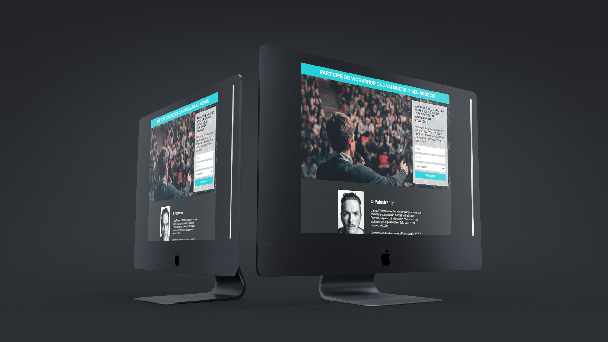

<h1>Página de Captura - Workshop</h1>

  

<h2 align="center">
  Acesse a Página clicando <a href="https://eltonalmeid.github.io/PaginaDeCaptura-Workshop/">AQUI</a>
</h2>

   Projeto desenvolvido com ensinamentos do curso ProgramadorBR

  <a href="#clipboard-sobre-o-projeto">Sobre o Projeto</a>&nbsp;&nbsp;&nbsp;|&nbsp;&nbsp;&nbsp;
  <a href="#computer-tecnologias-utilizadas">Tecnologias</a>

## :clipboard: Sobre o Projeto
Essa página de captura foi desenvolvida com objetivo de capturar o contato do visitante para 
que ele saiba quando o evento será realizado, e futuras novidades que possam haver.

## :computer: Tecnologias utilizadas

O projeto foi desenvolvido utilizando as seguintes tecnologias:

- HTML
- CSS
